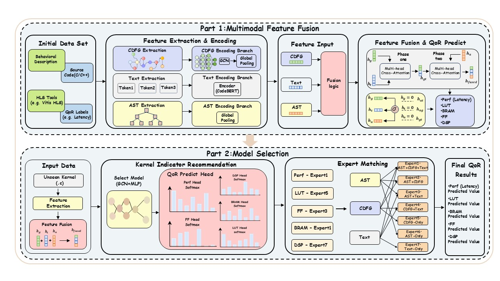

# MFF-KAS: Multimodal Feature Fusion and Kernel-Aware Selection for HLS QoR Prediction

Official implementation of **MFF-KAS** — seven multimodal fusion experts (CDFG + AST + Text) with **K**ernel-**A**ware expert **S**election (KAS) for FPGA HLS QoR prediction.

## 📋 Content

- [About the Project](#-about-the-project)
- [Contribution](#-contribution)
- [Project File Tree](#-project-file-tree)
- [Required Environment](#-required-environment)
- [Data & Checkpoints](#-data--checkpoints)
- [Quick Start](#-quick-start)
- [Test Split](#-test-split)
- [Citation](#-citation)

## 🎯 About the Project

This repository provides an end-to-end framework for **HLS QoR prediction** on MachSuite and PolyBench. Given C/C++ source and pragma configurations, the system builds three parallel representations — **CDFG**, **AST**, and **Text** — and predicts post-synthesis QoR (Latency, LUT, FF, DSP, BRAM) without invoking synthesis for every design point.

**Part 1 (MFF)** trains seven modality-specific fusion experts (all non-empty subsets of `{CDFG, AST, Text}`), each with five metric-specific regression heads sharing one encoder–fusion backbone. **Part 2 (KAS)** learns a per–QoR-metric selector that routes each unseen kernel to the most suitable frozen expert at inference time (PPO on validation best-expert labels).

<p align="center">
  
</p>

*Figure: Overall pipeline — Part 1 multimodal feature fusion (MFF) and Part 2 kernel-aware expert selection (KAS).*

## 🌟 Contribution

We develop the **MFF-KAS** framework. Main contributions:

### 1. AST-Aware Multimodal Representation

We introduce **AST** as a syntactic complement to CDFG and source Text, preserving pragma–loop associations and hierarchical structure that are hard to retain in graph-only or sequence-only inputs.

### 2. Multimodal Feature Fusion (MFF)

We propose **MFF**, which fuses CDFG, AST, and Text via two-stage multi-head cross-attention and gated residuals, and systematically evaluates all **seven** non-empty modality subsets as separate fusion experts.

### 3. Kernel-Aware Selector (KAS)

Because no single fixed fusion dominates all kernels and QoR metrics, we train **KAS** to adaptively select among seven pretrained experts per unseen kernel and metric, improving cross-kernel generalization over fixed trimodal fusion and SOTA predictors.

## 📂 Project File Tree

```
MFF-KAS/
│
├── 架构图.jpg                 # Framework figure (shown above)
├── src/                       # Part 1: expert training & inference
│   ├── config.py              # Global flags, kernels, paths
│   ├── model.py               # Net / MFF fusion module
│   ├── train.py               # Training & inference loops
│   ├── main.py                # Entry point (train / inference)
│   └── comp_model/            # Baseline encoders (GNN-DSE, MPM, etc.)
│
├── algorithm_select/          # Part 2: KAS training & evaluation
│   ├── select_main.py           # Main KAS trainer (PPO / supervised)
│   ├── select_model.py          # Selector network
│   ├── select_dataset.py        # Dataset + labels.json loader
│   ├── build_labels_from_data_csv.py
│   ├── inference_engine*.py     # KAS + expert inference
│   └── plot_best_expert_heatmap.py
│
├── data/                      # Expert prediction CSVs (labels / analysis)
├── dse_database/              # ProGraML graphs & HLS configs (large)
└── save_models_and_data/      # Expert checkpoints (not shipped by default)
```

> `two_tower_dataset/` and `two_tower_datasets/` (AST `.pt` graphs) are **not** included in Git. See [Data & Checkpoints](#-data--checkpoints).

## 🔧 Required Environment

### Operating System

- Linux (recommended) or Windows

### Software Dependencies

- **Python:** 3.9+
- **PyTorch:** 2.x (+ CUDA matching your GPU driver)
- **PyTorch Geometric:** 2.x (CDFG / AST GNN; see [install guide](https://pytorch-geometric.readthedocs.io/en/latest/install/installation.html))
- **transformers** + **tokenizers** (CodeBERT)
- **numpy**, **pandas**, **scikit-learn**, **tqdm**, **networkx**, **requests**

Example install:

```bash
pip install torch torchvision torchaudio --index-url https://download.pytorch.org/whl/cu121
pip install torch-geometric transformers scikit-learn pandas tqdm networkx requests
# Install PyG wheel extensions per your CUDA version (see PyG docs)
```

> This is an academic research project. Refer to the paper for methodology and experimental details.

## 📦 Data & Checkpoints

Large artifacts are **not** included in Git:

| Artifact | Location | Notes |
|----------|----------|--------|
| ProGraML CDFG / configs | `dse_database/` | MachSuite / PolyBench DSE pipeline |
| AST `.pt` graphs | `two_tower_datasets/code/ast_final_dataset/` | Download separately; place under repo root |
| Expert weights | `save_models_and_data/` | One checkpoint per modality subset |
| KAS policies | `algorithm_select/save/` | Per-metric selector |
| Expert pred CSVs | `data/regression_model_pred_{train,test}_<expert>.csv` | For `build_labels_from_data_csv.py` |

Contact the authors or open an issue for data/checkpoint release links if applicable.

## 🚀 Quick Start

Run from the repository root.

### 1. Train seven MFF experts

Configure modality / tag in `src/config.py`, then:

```bash
cd src
python main.py   # set FLAGS.subtask = 'train' in config.py
```

Train separately for: `all`, `ast`, `cdfg`, `text`, `ast_and_cdfg`, `ast_and_text`, `cdfg_and_text`.  
Export predictions to `data/regression_model_pred_{train,test}_<expert>.csv`.

### 2. Build KAS supervision labels

```bash
python algorithm_select/build_labels_from_data_csv.py
```

### 3. Train KAS (per QoR metric)

```bash
python algorithm_select/select_main.py --train_mode ppo --target_m_id 0
# 0=Latency(perf), 1=LUT, 2=FF, 3=DSP, 4=BRAM — repeat for each metric
```

### 4. Inference & evaluation

```bash
python algorithm_select/inference_engine(加载json版本且数据随机化分).py
python algorithm_select/plot_best_expert_heatmap.py
```

## 📊 Test Split

| Train pool (15 kernels) | Held-out test (†, 7 kernels) |
|-------------------------|--------------------------------|
| adi, aes, bicg, … | atax†, gemm-p†, gesummv†, jacobi-1d†, jacobi-2d†, nw†, spmv-ellpack† |

Train/val on the 15-kernel pool: **8:2** random split; KAS labels from validation errors.

Macro-averaged RMSE in the paper uses **All** = sum of RMSE over Latency, LUT, DSP, FF, and BRAM.

## 📖 Citation

If you use this code, please cite our paper (bibtex TBD after publication).

## License

Academic research use. Contact the authors for other uses.
